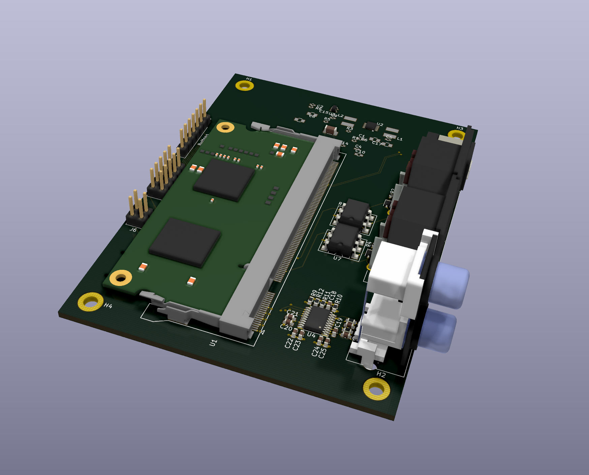

# mt32-cm3plus
This is a CM3+ version of the MT32Pi hardware. All layout is done in Kicad and I will create release files with everything needed to get a run of boards done and half assembled with jlcpcb.

This project is a hardware implementation designed to work with [MT32-Pi](https://github.com/dwhinham/mt32-pi)

_THIS IS A WORK IN PROGRESS AND ISN'T COMPLETE_

You should not build this till there are is a working release. The convention I will be using is to call something a release candidate (RC) till I know everything I have added works and I have reasonable documentation. If you do not see reasonable documentation, either contribute doco, ideas or bugs you can see in what I have done. The plan is to have everything that can be populated out of JLCPCB basic parts on the underside so that a lot of the fiddly bits are already done. The SODIMM connector for the CM3+ is not simple if you don't have a good iron and good flux. Both can be found on Aliexpress with a bit of research but flux is more of a gamble.

I plan to continue improving the device, so if you have any ideas put them in.

